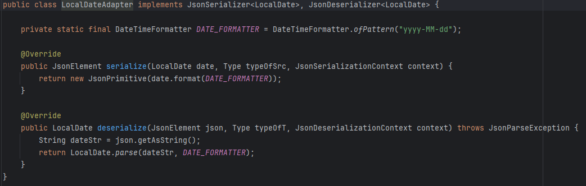

# DesarrolloWebEntornosServidor-PR01-Funkos-2023-2024

## Autor
* David Jaraba

## Requisitos
- Java 17 o superior
- Gradle
- CSV con los datos de los Funkos, con el formato `COD,NOMBRE,MODELO,PRECIO,FECHA_LANZAMIENTO`

## Configuración
Para configurar la base de datos se puede editar el fichero `application.properties`

    db.username=sa
    db.password=1234
    db.name=default
    db.loadTables=true
    db.initScript=init.sql

## Pasos
- En primer lugar, se ha creado la estructura básica para el proyecto, creando
`dev.controllers` que se va ha utilizar para publicar los metodos, junto a `dev.services` que
va ha ser donde se ubique la lógica.

Ejemplo del [FunkoController](src/main/java/dev/controllers/FunkoController.java)

Ejemplo del [FunkoService](src/main/java/dev/services/FunkoService.java)

- En segundo lugar, se han creado metodos como `importCSV()` para leer el CSV dado
y transformarlo a un POJO llamado `Funko`.

- En tercer lugar, se ha creado la clase [DatabaseManager](src/main/java/dev/managers/DatabaseManager.java) para gestionar
la conexión y las consultas a la BD. Hace uso del fichero de configuración `application.properties` para establecer la conexión.

- En cuarto lugar, se ha creado un script SQL para crear la base de datos con los campos necesarios indicados. También, se ha generado el CRUD
para soportar las operaciones básicas de este y agrergar también `findByNombre()`

    Para esto se han creado dos interfaces:
    
    
    
    Las cuales se han implementados en [FunkosRepoImpl](src/main/java/dev/repositories/FunkosRepoImpl.java)

- En quinto lugar, se ha agregado una caché en [FunkoDBImpl](src/main/java/dev/services/db/FunkoDBImpl.java).
  

- En sexto lugar, se han agreado las excepciones personalizadas unchecked, se han agregado los adaptadores para que sea posible 
exportar a JSON y se han creado los locales para poder convertir todo al formato ES en la salida.

  **Excepciones personalizadas**
  
  **Locale**
  
  **Adaptadores**
  

- En séptimo lugar, se han implementado las funcionalidades solicitadas en [FunkoService](src/main/java/dev/services/FunkoService.java).

- Por último se han agregado test unitarios para testear las funcionalidades implementadas. Para esto se ha 
usado JUNIT5 y Mockito.
 [Tests](src/test/java/FunkoServiceTest.java)

  